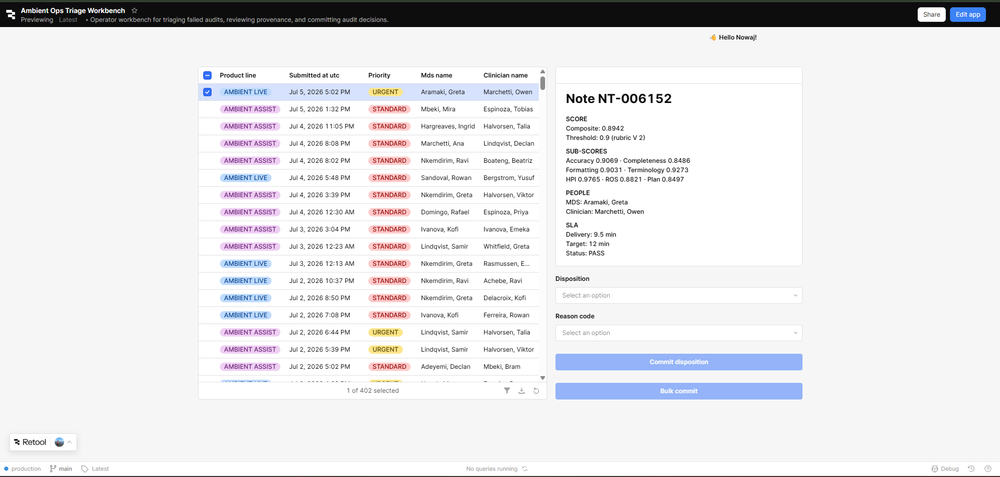

# UX_RATIONALE — Triage Workbench

Operator: the **Audit Triage Lead**. Their job is not reading notes — it is
deciding what happens to notes that failed audit, without losing their place.

---

## 1. Time-on-task budget

402 failed audits in the queue under the corrected Part 1 logic.
**Target: ~25s per case** — ~10s orient, ~10s decide, ~5s commit. That is
~2.8 hours to clear the backlog: realistic over two sittings, and not a number
that forces skimming.

The 10s of orient time is where the judgment happens, so the provenance panel
carries the whole decision — score, the threshold *that applied to this note*,
rubric version, delivery against *the SLA in force on the note's date* — with
no second click. The queue table deliberately carries less; scanning a wide
table costs orient time without improving the decision.

No confirmation on single commit: it would tax every case to prevent a cheap
mistake (a decision row, not a destructive action). Bulk commit *does*
confirm, because that one is not cheap to reverse.

---

## 2. R2 — interaction count

**Required ≤4 after selection. Actual: 3.**

| # | Interaction | Why not fewer |
|---|---|---|
| 1 | Choose disposition | The decision itself |
| 2 | Choose reason code | A disposition without a reason isn't auditable |
| 3 | Click **Commit** | R7 requires explicit commit — row-click must not mutate |

Counting the row click, a full case is 4 — inside budget either way. The spare
interaction is what lets commit stay explicit; auto-committing on reason-code
selection would hit 2 and break R7.

One combined "disposition + reason" dropdown would be 12 options in one
control — slower to scan than two short lists, and it couples two fields whose
taxonomies will drift apart.

---

## 3. Two layouts I rejected

**The full-width table.** First build showed all 13 columns from the queue
query. It needed horizontal scroll at 1366×768, and the columns that matter for
*deciding* (threshold, rubric version, SLA target) sat off-screen right — so
the lead scrolled sideways on every case, a cost paid 402 times. Replaced by:
table carries what's needed to *choose* the next case; everything needed to
*decide* lives in the always-visible provenance panel.

**The twelve-component provenance panel.** One Text component per field.
Twelve components is twelve things to keep aligned, Retool's grid made the
vertical rhythm fragile (adding one field nudged the rest), and the information
hierarchy was invisible — twelve peers, no grouping. Replaced by a single
Markdown component with `SCORE` / `PEOPLE` / `SLA` headers. The trade:
per-field conditional styling is now harder; a field needing its own colour
would have to come back out into its own component.

---

## 4. The requirement I did not fully satisfy: R3 (keyboard loop)

Retool exposes custom shortcuts only at **app scope**, but every component here
is **page-scoped** to `page1`, and app-scope handlers cannot reference
page-scoped components.

**Tried:** direct reference (`TriageQueue.selectRow(...)`) → *"out of scope"*;
namespaced (`page1.TriageQueue...`) → *"'page1' is out of scope"*; indirection
via a page-scoped JS query → the shortcut can't name the query either; moving
the queue query from Global to `page1` → fixed the query's scope, not the
handler's.

**The trade.** Closing this means rebuilding components at app scope or writing
a custom key-capture layer. R7 and R8 affect whether the tool produces *wrong
data*; R3 affects whether it produces data *slowly*. I spent the time on the
former. The cost is real: 3 interactions per case with a mouse, but no
hands-on-keyboard operation, and a lead clearing 402 cases would feel it.

**Next step:** a hidden text input inside the page scope that holds focus and
captures `keydown` — `j`/`k` for navigation, `1`–`4` disposition, `q w e r`
reason code, `Enter` commit. Page-scoped, so it never crosses the boundary that
blocked the app-scope route. **Untested** — the approach I'd try first, not a
verified solution, and focus-management against a table that also wants arrow
keys is where I'd expect trouble.

---

## 5. How the rest are met

| # | Implementation |
|---|---|
| **R1** | Two-pane ~60/40 split. Table fixed height with internal scroll; panel and controls fit without page scroll. App max width 1200px. |
| **R4** | Full result set in one table, no pagination cap. **Persist row selection** enabled — without it, refresh reset selection to row 0, exactly the failure the requirement warns about. |
| **R5** | Composite recomputed from the rubric weights in force for that audit's version; threshold for *that* version; SLA target resolved by effective-dated join on the note's own Chicago business date — not today's config. This is why the queue query joins `sla_config` on a date predicate, not on product/priority alone. |
| **R6** | **Loading:** Retool's built-in state, which overlays rather than reflows. **Empty:** "No failed audits in the queue — all clear." **Error:** text component hidden on `{{ !getTriageQueue.error }}`, in reserved space above the table so appearing doesn't push content down. |
| **R7** | Commit is a button, never a row-click. Button `loading` binds to `commitDisposition.isFetching`. Success and failure notifications both on; on failure the dropdowns are *not* cleared, so the pending decision survives for retry. Clear-on-success lives in the query's success handler, not the button's click handler — see §6. |
| **R8** | Multi-select on. Bulk gated on `selectedRows.length >= 2`, single on `=== 1`, so the two are mutually exclusive and the affordance decides which applies. Confirmation names disposition, reason, row count, and that already-committed notes are skipped. Double-submit safe via `ON CONFLICT (note_id) DO NOTHING`. |
| **R9** | Every status carries text: `URGENT`/`STANDARD`, `AMBIENT LIVE`/`AMBIENT ASSIST`, `PASS`/`BREACH`. The panel states the numeric gap from threshold rather than signalling severity by colour. Colour is redundant with the label, never the sole carrier. |
| **R10** | Queue deduplicates `note` to latest ingestion, excludes voids, joins `clinician` on current record, recomputes composite from `rubric_weight` per the audit's own version. It does not read `note_audit.pass_fail` or `.composite_score` — both wrong for v2 (RECONCILIATION.md D4, D6). |

---

## 6. Two things that broke

**Clearing the form raced the insert.** The first version cleared both
dropdowns from the *button's* click handler alongside the query trigger. Retool
fires click handlers together, not in sequence, and the query is async — so the
dropdowns cleared mid-flight and the insert wrote NULLs. The not-null
constraint caught it, which is the good outcome; a nullable column would have
written silent garbage. I first patched with a debounce and an `Only run when`
guard — a timing guess, not a fix. The real fix was moving the clear actions
into the **query's own success handler**, where they cannot run before the
insert returns.

**Double-submit needed a constraint, not just a clause.** `ON CONFLICT DO
NOTHING` does nothing without something to conflict against. The original
`UNIQUE (note_id, decided_at_utc)` could never fire — `decided_at_utc` defaults
to `now()` and differs every insert. `CREATE UNIQUE INDEX ON
triage_decision(note_id)` is what actually makes bulk commit idempotent. I
checked for existing duplicates first (none) and dropped the now-redundant
non-unique index on the same column.

`decided_by` comes from `current_user.email` — Retool's authenticated session,
not operator input — so the audit trail can't be spoofed by the person being
audited against it.

---

## 7. Annotated screenshot

<!--
TODO: annotate (1) queue columns = what's needed to CHOOSE, (2) provenance
panel = what's needed to DECIDE, (3) effective-dated SLA + rubric version,
(4) the two mutually-exclusive commit buttons, (5) selection count in footer.
-->

---

## 8. Known gaps

- **R3** not met; §4.
- **Filters don't survive refresh.** R4 names selection, scroll, and filters.
  Selection is handled; filter state resets on refresh and binding it to a
  state variable was work I didn't reach. Scroll follows selection in practice,
  but I haven't verified it independently.
- **Contrast not measured.** Colour-independence holds by construction — every
  status is labelled. The ≥4.5:1 ratio on Retool's default tag colours is
  untested; light-pink `STANDARD` and light-blue `AMBIENT LIVE` are what I'd
  measure first.
- **No pagination strategy.** 402 rows load fine; at the 3,000 the requirement
  names the query returns everything in one response. Not load-tested, and a
  production build would page the query rather than the table.